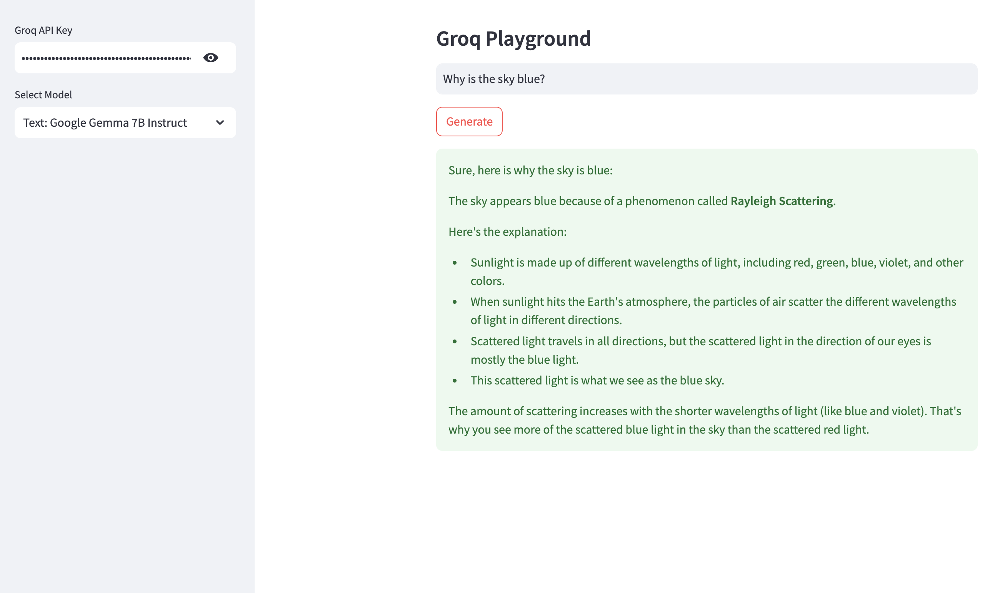

# groq
[Groq](https://groq.com) is a platform for running large language models (LLMs) in a token-based pricing model, without having to manage your own infrastructure. Groq uses LPU Inference Engines, a new type of end-to-end processing unit system that provides fast inference for computationally intensive systems. Sign up for an account at [GroqCloud](https://console.groq.com/keys) and get an API token, which you'll need for this project.

This repository showcases a simple Streamlit app for running the following open-source text models on Groq:
* Text: Meta Llama 3.3 70B
* Text: Meta Llama 4 Scout 17B (Preview)
* Text: Google Gemma 2 9B Instruct
* Text: Mistral Saba 24B (Preview)
* Text: Alibaba Qwen QwQ 32B (Preview)
* Text: DeepSeek R1 (Preview)

